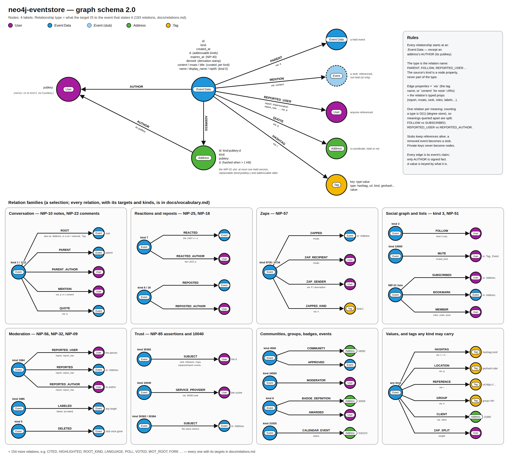

# Graph schema reference

**Schema version 2.0** (the live value is in `:Meta.schema_version` and `GET /graph/schema`).

This is the contract for anyone writing Cypher against the graph. Labels, relationship types and
property names are API:
- **additive** changes bump the minor version: a new relation, a new props field, a newly mapped
  kind, a new curated value;
- **renames and removals** bump the major version, and are announced with migration notes.

The graph is a **projection** of the events the relay's Vespa store holds. It keeps no event
bodies: an `:Event:Data` node that a query returns is hydrated into the full NIP-01 event
unless the request says `"hydrate": false`.



The drawing is [`schema.svg`](schema.svg), generated by [`schema-diagram.py`](schema-diagram.py).

**2.0 in one line:** a relationship's type says what its target IS to the event — `ROOT`,
`PARENT`, `REACTED`, `FOLLOW`, `REPORTED_USER` — instead of which tag carried it (1.x's `e_1`,
`p_3`, `p_1984`). What each kind's references mean is decided once, per Quartz event class, in
the [link vocabulary](vocabulary.md).

---

## Nodes

| Label | Key | Properties | Notes |
|---|---|---|---|
| `:Event:Data` | `id` (64-hex) | `kind`, `created_at`, `d` (addressable kinds), `expires_at` (NIP-40), and curated values (below) | An event the relay holds |
| `:Event` (without `:Data`) | `id` | — | A **stub**: an id something references that the relay does not hold. Filter with `NOT n:Data` (e.g. "most-cited missing events"). |
| `:User` | `pubkey` (64-hex) | — | Anyone who authored or was referenced. Names live on their kind 0 (below). |
| `:Address` | `id` = `kind:pubkey:d` | `kind`, `pubkey`, `d` | Every replaceable (`3:<pk>:`, `10002:<pk>:`) and addressable (`30023:<pk>:<d>`) event's own address, plus any address something references. Kinds are 0–65535. A `d` longer than 1024 UTF-8 bytes appears as `sha256:<hex of the d>` (the key must stay indexable); it is still one node per distinct `d`. |
| `:Tag` | `key` = `type:value` | `type`, `value` | A value a kind links that is not an event, user or address, keyed by what it IS: a hashtag (`hashtag:nostr`), a URL (`url:https://…`), a place (`geohash:u4pr`), a kind (`kind:1`), an external id (`external:isbn:…`), a group (`group:<id>`). Never by the tag letter that carried it, so an `r` URL and a NIP-73 `i` URL are one node. Every type is in the [catalog](relations.md#value-types). Values of 256 bytes or less. |

**An `:Event` node is the id; `:Data` marks that its event is held.** A reference to an id
points at the `:Event`, which exists whether or not the event is held (a stub), as an `:Address`
exists whether or not a version fills its slot. The difference is how many events stand behind
each: an id names one event forever, so its data joins the same node (`:Data`); an address names a
slot that many versions fill over time, so each version is its own node, attached by `ADDRESS`.

| | Is it held? |
|---|---|
| An id | `n:Data` |
| An address | `EXISTS { (a)<-[:ADDRESS]-(:Data) }` |

**An event's author is an edge, not a property.** Filter by author from the user:
`(:User {pubkey: $pk})<-[:AUTHOR]-(n:Data)`.

**A user's names are on their profile, not on the `:User`.** A kind 0 is replaceable, so its
own address `0:<pk>:` reaches the current one with an index seek and one hop:
`(:Address {id: '0:' + $pk + ':'})<-[:ADDRESS]-(profile:Data)` then `profile.name`,
`profile.display_name`, `profile.nip05`. To name the users a query returns, add
`OPTIONAL MATCH (:Address {id: '0:' + u.pubkey + ':'})<-[:ADDRESS]-(p:Data)` per row. The other
way round, `(:Data {nip05: $name})-[:AUTHOR]->(u)` is an index seek. The `:User` carries no
copy: a copy would have to be cleared, and restored from another held kind 0, on every removal.

**Replaceable and addressable events hang off their address.** Each version points at its own
`:Address` through `ADDRESS`, and the projection keeps exactly one held version per address. A
user's current follow list is one index seek away:
`(:Address {id: '3:' + $pk + ':'})<-[:ADDRESS]-(list:Data)`. Prefer that anchor over
`(u)<-[:AUTHOR]-(:Data {kind: 3})`, which walks everything the user ever signed.

## Relationships

Every relationship starts at an `:Event:Data`, except an address's `AUTHOR` (its pubkey).

The **type** is a relation of the [vocabulary](vocabulary.md): what the target is to the event
that states it. One relation per role across kinds: `PARENT` is a note reply's parent, a NIP-22
comment's parent item and a git reply's; the source node's `kind` says which, and a query that
cares filters on it (`(c:Data {kind: 1111})-[:PARENT]->(x)`). The full catalogue — 172
relations, each with its targets, meaning and kinds — is in [`vocabulary.md`](vocabulary.md#the-vocabulary),
and `GET /graph/schema` lists them. The ones most queries start from:

| Relation | From → to | Meaning |
|---|---|---|
| `AUTHOR` | Event → User; Address → User | The signer; an address's pubkey |
| `ADDRESS` | Event → Address | A replaceable / addressable event's own address (at most one held version per address) |
| `ROOT`, `PARENT` | Event → Event / Address / Tag | The thread root and the direct parent (NIP-10 notes, NIP-22 comments and their `I` scopes, chat, git, …). A direct reply to the root has both. |
| `ROOT_AUTHOR`, `PARENT_AUTHOR` | Event → User | Their authors, where the event names them (a `p` on a note is `PARENT_AUTHOR` only when it is the parent's author) |
| `MENTION`, `QUOTE` | Event → Event / User / Address | A reference without a structural role (a tag, or a `nostr:` URI in the content); a NIP-18 `q` |
| `REACTED`, `REACTED_AUTHOR` | Event → Event / Address; → User | A reaction's target (NIP-25: the LAST `e`/`a`) and its author (the last `p`) |
| `REPOSTED`, `REPOSTED_AUTHOR` | Event → Event / Address; → User | A repost's original and its author |
| `ZAPPED`, `ZAP_RECIPIENT`, `ZAP_SENDER` | Event → Event / Address; → User | A zap request's / receipt's content, recipient and (receipt `P`, or its embedded request's author `via: description`) sender |
| `FOLLOW` | Event → User | Kind 3 only: the social graph. Other follow-like lists are `SUBSCRIBED`. |
| `MUTE`, `BOOKMARK`, `PIN`, `MEMBER` | Event → … | NIP-51 lists name their entries as the list does |
| `REPORTED_USER`, `REPORTED`, `REPORTED_AUTHOR` | Event → User; → Event / Address / Tag; → User | NIP-56: a complaint about the PERSON; the reported content; the author of reported content |
| `DELETED` | Event → Event / Address | NIP-09 |
| `LABELED` | Event → … | NIP-32 |
| `SUBJECT` | Event → User / Event / Address / Tag | A NIP-85 assertion's subject (its `d`), with the scores |
| `SERVICE_PROVIDER` | Event → User | A 10040's trust services (`via` names the metric, e.g. `30382:rank`); a NIP-90 request's DVMs |
| `HASHTAG`, `LOCATION`, `REFERENCE`, `LANGUAGE`, `LABEL`, … | Event → Tag | A value's role: a topic, a place, a referenced URL, a language, a NIP-32 label. There is no generic "tag" relation |
| `ROOT_KIND`, `REACTED_KIND`, `ZAPPED_KIND`, … | Event → Tag (`kind:`) | The kind of the target the event's `X` relation points at, as the event states it (`k` / `K`) |
| `GROUP`, `COMMUNITY` | Event → Tag; → Address | A NIP-29 / Marmot / Buzz group (its `h`); a NIP-72 community |
| `CLIENT`, `ZAP_SPLIT`, `EMOJI_SET` | Event → Address; → User; → Address | Tags any event may carry: NIP-89 `client`, NIP-57 zap splits, a NIP-30 emoji's set |

- **Counts are O(1).** `COUNT { (u)<-[:FOLLOW]-() }` (followers) is read from Neo4j's per-type
  degree store, so it costs the same for an account with one follower or a million. That is why
  the vocabulary splits a relation wherever queries separate its meanings on one target type:
  counting a relation is constant-time, filtering on a property reads every edge.
- **No fallback.** A kind the pinned Quartz does not know states only `AUTHOR`, `ADDRESS` and the
  every-kind tags: its other tags mean nothing the projection can vouch for.

### Relationship properties

Every link a tag or the content states carries **`via`**: the tag name (`e`, `p`, `a`, `q`,
`30382:rank`, …) or `content` for a NIP-27 `nostr:` URI in the text. One target reached two ways
is two relationships (a 10040 naming one service for `30382:rank` and `30382:followers`).

The relations below carry **typed props** (`vocab/props`; absent values are left out):

| Relations | Properties |
|---|---|
| `ACTOR` | `path` (string) |
| `AUCTION` | `amount` (float) |
| `AUDITED` | `action` (string) |
| `BID` | `status` (string), `duration_extension` (integer) |
| `OPPONENT`, `WINNER` | `result` (string), `termination` (string) |
| `COLLABORATED`, `COLLABORATED_AUTHOR` | `roles` (list), `status` (string) |
| `CREDITED` | `credit` (string) |
| `FOUND` | `verified` (boolean) |
| `RECIPIENT`, `AGENT` | `frame` (string) |
| `ITEM` | `polarity` (float) |
| `LABELED` | `labels` (list) |
| `MEMBER` | `roles` (list), `order` (integer), `level` (integer), `title` (string), `score` (integer) |
| `ARCHIVED`, `BANNED`, `TIMED_OUT`, `UNARCHIVED` | `reason` (string), `expiration` (integer) |
| `MUTE` | `muted_kind` (integer) |
| `CURATED`, `PIN` | `order` (integer) |
| `OWNER` | `conditions` (string) |
| `PARTICIPANT` | `roles` (list), `proof` (string) |
| `RECOMMENDED` | `platform` (string) |
| `POLL` | `responses` (list) |
| `TAGGED` | `x` (integer), `y` (integer) |
| `RATED`, `RATED_AUTHOR` | `mark` (string), `stars` (float) |
| `SITE_MANIFEST` | `release` (string) |
| `REPORTED_USER`, `REPORTED`, `REPORTED_AUTHOR` | `report` (string), `report_raw` (string) |
| `RESOLVED` | `status` (string), `action` (string), `reason` (string) |
| `HIGHLIGHTED_AUTHOR`, `ADDED_USER`, `ADMIN`, `ALLOWED`, `PODCAST_AUTHOR`, `ROLE_CHANGED` | `roles` (list) |
| `CALENDAR_EVENT` | `status` (string), `fb` (string) |
| `SERVICE_PROVIDER` | `service` (string) |
| `CONFIRMED`, `REQUEST` | `status` (string) |
| `SUBJECT` | `rank` (integer), `followers` (integer), `hops` (integer), `first_created_at` (integer), `post_cnt` (integer), `reply_cnt` (integer), `reactions_cnt` (integer), `zap_amt_recd` (integer), `zap_amt_sent` (integer), `zap_cnt_recd` (integer), `zap_cnt_sent` (integer), `zap_avg_amt_day_recd` (integer), `zap_avg_amt_day_sent` (integer), `reports_cnt_recd` (integer), `reports_cnt_sent` (integer), `active_hours_start` (integer), `active_hours_end` (integer), `comment_cnt` (integer), `quote_cnt` (integer), `repost_cnt` (integer), `reaction_cnt` (integer), `zap_cnt` (integer), `zap_amount` (integer) |
| `VIEWED` | `phase` (string) |
| `VOTED` | `direction` (string) |
| `WOT_ROOT` | `depth` (integer) |
| `ZAPPED`, `ZAP_RECIPIENT` | `msats` (integer) |
| `ZAP_SPLIT` | `weight` (float) |

`report` is the report's CATEGORY as Quartz reads it (`spam`, `impersonation`, `illegal`,
`malware`, `nudity`, `profanity`, `harassment`, `violence`, or `other` for a type Quartz does not
know; localized labels fold in: `Spam 📣` is `spam`); `report_raw` is the type AS WRITTEN,
trimmed and lowercased (`swearing`, `ai-generated`), absent when the report wrote none. Integers
are Cypher integers; lists are string lists (test membership with `'admin' IN r.roles`).

### Curated values on nodes

| Where | Property | From |
|---|---|---|
| kind-7 `:Event` | `content` | The reaction symbol (`+`, `-`, an emoji, `:shortcode:`), up to 32 bytes |
| kind-9735 `:Event` | `msats` | The receipt's bolt11 amount |
| kind-9734 `:Event` | `msats` | The request's `amount` tag |
| kind-0 `:Event` | `name`, `display_name`, `nip05` | The profile's JSON, each a non-blank string of up to 256 bytes |
| kinds 30023, 30311, 34550 | `title` | The `title` tag (or `name` for a community) |

---

Amounts above 21M BTC (2.1×10¹⁸ msats) are not stored, so `sum(z.msats)` over real zaps cannot
overflow.


### Reports (NIP-56), in one place

A report reaches its subjects through three relations, and the question every report query
asks — about the person, or about their content? — is the relation itself:
- `REPORTED_USER`: the report names no content, so it is a standing complaint about the person;
- `REPORTED`: the reported event, address or blob;
- `REPORTED_AUTHOR`: the author of reported content (the report's `p` beside its `e` / `a` / `x`).

Each carries `report` and `report_raw`. Relationship indexes cover both properties on all three
relations, so a report query that is not anchored on one user still seeks rather than scans.

### Internal labels

`:Removed` (a short-lived fence of recently removed ids, swept after about two hours) and `:Meta`
(the schema singleton) belong to the projection's bookkeeping. They are not part of this contract.
Neither is the `derived` property on `:Data` nodes: the stamp of the derivation that wrote the
event. When a release changes what an event projects to, the reconciler rewrites each held event
whose stamp differs, in place, over the following full sweep; until it reaches an event, that
event still reads as the older release wrote it. `:Meta` records `schema_version`, `policy_hash`,
`derivation_version` and the `derived` stamp the graph is converging to. A build refuses to start
on a graph whose `schema_version` has another major.

### Indexes

Besides the four key constraints: `:Data(created_at)`, `:Data(kind)`, `:Data(expires_at)`,
`:Data(nip05)`, `:Address(kind)`, and `report` / `report_raw` on `REPORTED_USER`, `REPORTED` and
`REPORTED_AUTHOR`.

## Example queries

These are run by `ReferenceQueriesIT` against a graph with known answers. Parameters are passed
in the request's `params`.

```cypher
// T1 — follower count, and the followers
MATCH (u:User {pubkey: $pk}) RETURN COUNT { (u)<-[:FOLLOW]-() } AS followers;
MATCH (:User {pubkey: $pk})<-[:FOLLOW]-(:Data)-[:AUTHOR]->(f:User) RETURN f;

// T2 — follows-of-follows I don't follow, ranked by how many of my follows follow them
MATCH (:Address {id: '3:' + $me + ':'})<-[:ADDRESS]-(mine:Data)-[:FOLLOW]->(f:User)
MATCH (:Address {id: '3:' + f.pubkey + ':'})<-[:ADDRESS]-(:Data)-[:FOLLOW]->(fof:User)
WHERE fof.pubkey <> $me AND NOT EXISTS { (mine)-[:FOLLOW]->(fof) }
RETURN fof, count(DISTINCT f) AS via ORDER BY via DESC LIMIT 50;

// T3 — every note in a thread (every NIP-10 reply tags the root)
MATCH (root:Event {id: $id})<-[:ROOT]-(n:Data)
RETURN n ORDER BY n.created_at;

// T3b — the reply TREE, any depth, through direct-parent edges
MATCH (root:Event {id: $id}) ((p)<-[:PARENT]-(c:Data))+ (leaf)
RETURN leaf;

// T4 — notes my follows reacted to this week, by how many of them
MATCH (:Address {id: '3:' + $me + ':'})<-[:ADDRESS]-(:Data)-[:FOLLOW]->(f:User)
MATCH (f)<-[:AUTHOR]-(r:Data {kind: 7})-[:REACTED]->(n:Data)
WHERE r.created_at >= $since
RETURN n, count(DISTINCT f) AS reactors ORDER BY reactors DESC LIMIT 50;

// T5 — notes my follows zapped this week, by total sats
MATCH (:Address {id: '3:' + $me + ':'})<-[:ADDRESS]-(:Data)-[:FOLLOW]->(f:User)
MATCH (f)<-[:ZAP_SENDER]-(z:Data)-[:ZAPPED]->(n:Data {kind: 1})
WHERE z.created_at >= $since
RETURN n, sum(z.msats) AS msats, count(DISTINCT f) AS zappers ORDER BY msats DESC LIMIT 50;

// T6 — articles quoted by my follows' notes
MATCH (:Address {id: '3:' + $me + ':'})<-[:ADDRESS]-(:Data)-[:FOLLOW]->(f:User)
MATCH (f)<-[:AUTHOR]-(:Data {kind: 1})-[:QUOTE]->(a:Address)<-[:ADDRESS]-(article:Data)
RETURN article, count(*) AS quotes ORDER BY quotes DESC LIMIT 50;

// T8 — a community's approved posts and their authors
MATCH (c:Address {id: $community})<-[:COMMUNITY]-(approval:Data {kind: 4550})-[:APPROVED]->(post:Data)-[:AUTHOR]->(author:User)
RETURN post, author;

// T9 — who NIP-85 service S ranks >= 80
MATCH (:User {pubkey: $service})<-[:AUTHOR]-(:Data {kind: 30382})-[a:SUBJECT]->(u:User)
WHERE a.rank >= 80
RETURN u, a.rank ORDER BY a.rank DESC;

// T10 — events my follows cite that the relay does not hold
MATCH (:Address {id: '3:' + $me + ':'})<-[:ADDRESS]-(:Data)-[:FOLLOW]->(f:User)
MATCH (f)<-[:AUTHOR]-(n:Data)-[:MENTION|QUOTE|PARENT|ROOT]->(missing:Event)
WHERE NOT missing:Data
RETURN missing.id, count(*) AS citations ORDER BY citations DESC LIMIT 50;

// T11 — hashtags used alongside #bitcoin in the last day
MATCH (:Tag {key: 'hashtag:bitcoin'})<-[:HASHTAG]-(n:Data)-[:HASHTAG]->(o:Tag)
WHERE n.created_at >= $since AND o.key <> 'hashtag:bitcoin'
RETURN o.value, count(*) AS uses ORDER BY uses DESC LIMIT 20;

// T12 — who reported X as a PERSON (not one of X's notes), among the people I follow
MATCH (:User {pubkey: $x})<-[r:REPORTED_USER]-(:Data)-[:AUTHOR]->(reporter:User)
WHERE EXISTS { (:Address {id: '3:' + $me + ':'})<-[:ADDRESS]-(:Data)-[:FOLLOW]->(reporter) }
RETURN reporter, r.report;

// T13 — users with reports that count: the standard categories only, so types clients
// invented for minor things (`swearing` is category `other`) drop out
MATCH (u:User)<-[r:REPORTED_USER|REPORTED_AUTHOR]-(rep:Data)
WHERE r.report IN ['impersonation', 'spam', 'illegal', 'malware'] AND rep.created_at >= $since
RETURN u, type(r) AS about, count(*) AS reports ORDER BY reports DESC LIMIT 50;

// T14 — one invented type, by its text
MATCH (:Data)-[r:REPORTED {report_raw: 'swearing'}]->(n:Data) RETURN n;

// Hybrid — full-text search in Vespa first (a NIP-50 REQ), then the graph
UNWIND $ids AS id
MATCH (n:Event:Data {id: id})<-[:REACTED]-(:Data)-[:AUTHOR]->(r:User)
RETURN n, count(DISTINCT r) AS reactors ORDER BY reactors DESC;
```

## Showcase: what meaning-typed relations buy you

Each query below would need per-kind tag knowledge under a `<tag>_<kind>` schema (which `e` is the
root? which `p` is the zap sender? which `a` is a badge?). With the vocabulary the relation already
says it, so queries cross kinds freely. `ShowcaseQueriesIT` runs every one of these, extracted from
this file, against a fixture graph with known answers: edit a query here and the test runs the
edit.

```cypher
// S1 — A reputation profile in O(1) per line: every count reads Neo4j's per-type degree store,
// so it costs the same for a newcomer and for an account with a million followers.
MATCH (me:User {pubkey: $me})
RETURN
  COUNT { (me)<-[:FOLLOW]-() }          AS followers,
  COUNT { (me)<-[:MUTE]-() }            AS mutedBy,
  COUNT { (me)<-[:REPORTED_USER]-() }   AS reportsAboutMe,
  COUNT { (me)<-[:REPORTED_AUTHOR]-() } AS reportsAboutMyContent,
  COUNT { (me)<-[:ZAP_RECIPIENT]-() }   AS zapsReceived,
  COUNT { (me)<-[:ZAP_SENDER]-() }      AS zapsSent,
  COUNT { (me)<-[:REACTED_AUTHOR]-() }  AS reactionsToMyContent,
  COUNT { (me)<-[:PARENT_AUTHOR]-() }   AS repliesToMe,
  COUNT { (me)<-[:AWARDED]-() }         AS badgesAwarded;

// S2 — Everything the network did with one article, across kinds: NIP-22 comments (ROOT),
// reactions, quotes, highlights, zaps, labels, reports — one hop, grouped by what it means.
MATCH (a:Address {id: $article})<-[r]-(e:Data)
WHERE NOT type(r) IN ['ADDRESS']
RETURN type(r) AS relation, e.kind AS kind, count(*) AS events
ORDER BY events DESC;

// S3 — Tagged vs. cited: the same MENTION, told apart by `via` (a `p` tag that notifies vs. a
// `nostr:` URI in the prose), per kind.
MATCH (me:User {pubkey: $me})<-[m:MENTION]-(n:Data)
WHERE n.created_at >= $since
RETURN m.via AS how, n.kind AS kind, count(*) AS mentions
ORDER BY mentions DESC;

// S4 — Conversations with the most distinct voices: every NIP-10 reply points at its ROOT,
// whatever depth it sits at.
MATCH (root:Data {kind: 1})<-[:ROOT]-(reply:Data)-[:AUTHOR]->(who:User)
WHERE root.created_at >= $since
WITH root, count(reply) AS replies, count(DISTINCT who) AS voices
WHERE voices >= 5
RETURN root, replies, voices ORDER BY voices DESC, replies DESC LIMIT 20;

// S5 — The deepest branches of a reply tree: a quantified path over PARENT, to the leaves.
MATCH path = (root:Event {id: $id}) ((p)<-[:PARENT]-(c:Data)){1,12} (leaf:Data)
WHERE NOT EXISTS { (leaf)<-[:PARENT]-(:Data) }
RETURN leaf.id AS leaf, length(path) AS depth
ORDER BY depth DESC LIMIT 10;

// S6 — Reactions to a note weighted by MY trust provider: my 10040 names the service whose
// 30382 cards rank people; each reactor's rank comes from that service's card about them.
MATCH (:Address {id: '10040:' + $me + ':'})<-[:ADDRESS]-(:Data)-[:SERVICE_PROVIDER {via: '30382:rank'}]->(provider:User)
MATCH (:Event:Data {id: $note})<-[:REACTED]-(r:Data)-[:AUTHOR]->(reactor:User)
OPTIONAL MATCH (reactor)<-[s:SUBJECT]-(card:Data {kind: 30382})-[:AUTHOR]->(provider)
WITH reactor, r, coalesce(s.rank, 0) AS rank
RETURN r.content AS reaction, count(*) AS votes, sum(rank) AS trust
ORDER BY trust DESC;

// S7 — My biggest zappers, and whether I follow them back: ZAP_RECIPIENT carries the amount,
// ZAP_SENDER names the zapper (from the receipt's `P`, or the zap request it embeds).
MATCH (me:User {pubkey: $me})<-[zr:ZAP_RECIPIENT]-(receipt:Data {kind: 9735})-[:ZAP_SENDER]->(fan:User)
WHERE receipt.created_at >= $since
WITH fan, sum(zr.msats) AS msats, count(receipt) AS zaps
OPTIONAL MATCH (:Address {id: '3:' + $me + ':'})<-[:ADDRESS]-(mine:Data)-[f:FOLLOW]->(fan)
RETURN fan, zaps, msats / 1000 AS sats, f IS NOT NULL AS iFollowThem
ORDER BY msats DESC LIMIT 25;

// S8 — Web-of-trust moderation: people reported AS PEOPLE (not for one note) by at least three
// of my follows' follows, in serious categories, that I have not already muted.
MATCH (:Address {id: '3:' + $me + ':'})<-[:ADDRESS]-(:Data)-[:FOLLOW]->(f:User)
MATCH (:Address {id: '3:' + f.pubkey + ':'})<-[:ADDRESS]-(:Data)-[:FOLLOW]->(fof:User)
WITH DISTINCT fof WHERE fof.pubkey <> $me
MATCH (fof)<-[:AUTHOR]-(rep:Data {kind: 1984})-[r:REPORTED_USER]->(suspect:User)
WHERE r.report IN ['impersonation', 'spam', 'illegal']
WITH suspect, r.report AS category, count(DISTINCT fof) AS reporters
WHERE reporters >= 3
AND NOT EXISTS { (:Address {id: '10000:' + $me + ':'})<-[:ADDRESS]-(:Data)-[:MUTE]->(suspect) }
RETURN suspect, category, reporters ORDER BY reporters DESC;

// S9 — What a labeler I trust has labeled, and how: NIP-32 labels ride the LABELED edge as a
// list of `namespace:label`, whatever the target's kind (note, user, article, URL).
MATCH (labeler:User {pubkey: $labeler})<-[:AUTHOR]-(l:Data {kind: 1985})-[r:LABELED]->(target)
WHERE any(label IN r.labels WHERE label STARTS WITH 'ugc:')
RETURN labels(target)[0] AS what, r.labels AS labels, count(*) AS labeled
ORDER BY labeled DESC LIMIT 50;

// S10 — Who was awarded a badge, and who wears it: the award (kind 8) names the definition and
// the awardees; a profile badge list (30008 `profile_badges`, or 10008) accepts the award.
MATCH (:Address {id: $badge})<-[:BADGE_DEFINITION]-(award:Data {kind: 8})-[:AWARDED]->(u:User)
OPTIONAL MATCH (shelf:Address)<-[:ADDRESS]-(list:Data)-[:BADGE_AWARD]->(award)
WHERE shelf.id IN ['30008:' + u.pubkey + ':profile_badges', '10008:' + u.pubkey + ':']
RETURN u, list IS NOT NULL AS wearsIt ORDER BY wearsIt DESC;

// S11 — A community's moderators at work: the definition names them (MODERATOR), their
// approvals (4550) point at the community and at the posts they approved.
MATCH (c:Address {id: $community})<-[:ADDRESS]-(def:Data)-[:MODERATOR]->(mod:User)
OPTIONAL MATCH (c)<-[:COMMUNITY]-(approval:Data {kind: 4550})-[:AUTHOR]->(mod)
WHERE approval.created_at >= $since
OPTIONAL MATCH (approval)-[:APPROVED]->(post:Data)
RETURN mod, count(DISTINCT approval) AS approvals, count(DISTINCT post) AS postsStillHeld
ORDER BY approvals DESC;

// S12 — What Nostr says about a book, a URL or a podcast (NIP-73 external ids): NIP-22 comments
// scope it as ROOT / PARENT, other kinds react to or mention it — one `:Tag` node joins them all.
// (A URL is `url:` + the URL, whether an `r` or an `i` named it.)
MATCH (subject:Tag {key: 'external:' + $externalId})<-[r:ROOT|PARENT|REACTED|MENTION]-(e:Data)-[:AUTHOR]->(who:User)
RETURN type(r) AS relation, e.kind AS kind, count(e) AS events, count(DISTINCT who) AS people
ORDER BY events DESC;

// S13 — The most highlighted sources, and who the highlighted passages themselves cite: CITED
// keeps a quoted author's `nostr:` references apart from the highlighter's own MENTIONs.
MATCH (h:Data {kind: 9802})-[:HIGHLIGHTED]->(source)
WHERE h.created_at >= $since
OPTIONAL MATCH (h)-[:CITED]->(cited)
RETURN source, count(DISTINCT h) AS highlights, collect(DISTINCT cited)[..5] AS citedInExcerpts
ORDER BY highlights DESC LIMIT 20;

// S14 — Replies left behind by deletions: the deleted note is gone (a stub), the NIP-09 request
// still points at it, and so do the replies that were written to it.
MATCH (del:Data {kind: 5})-[:DELETED]->(gone:Event)
WHERE NOT gone:Data AND del.created_at >= $since
MATCH (gone)<-[:PARENT]-(orphan:Data)
RETURN gone.id AS deleted, count(orphan) AS repliesLeftBehind
ORDER BY repliesLeftBehind DESC LIMIT 20;

// S15 — Who is going to an event, and how many of them I follow: NIP-52 RSVPs carry their
// status on the CALENDAR_EVENT edge.
MATCH (:Address {id: $calendarEvent})<-[r:CALENDAR_EVENT]-(rsvp:Data {kind: 31925})-[:AUTHOR]->(u:User)
WITH u, r.status AS status
OPTIONAL MATCH (:Address {id: '3:' + $me + ':'})<-[:ADDRESS]-(:Data)-[f:FOLLOW]->(u)
RETURN status, count(u) AS people, count(f) AS peopleIFollow;

// S16 — Degrees of separation through CURRENT follow lists only: each hop goes user → their
// kind-3 address → its one held version → FOLLOW, so superseded lists never form a path.
MATCH path = SHORTEST 1
  (a:User {pubkey: $from})
  (()<-[:AUTHOR]-(:Address {kind: 3})<-[:ADDRESS]-(:Data)-[:FOLLOW]->()){1,4}
  (b:User {pubkey: $to})
RETURN length(path) / 3 AS hops, [n IN nodes(path) WHERE n:User | n.pubkey] AS chain;

// S17 — Rank a search result (ids from a NIP-50 REQ to the relay) by engagement, every signal an
// O(1) degree read: reactions, reposts, quotes, direct replies, thread size, zaps.
UNWIND $ids AS id
MATCH (n:Event:Data {id: id})
RETURN n.id AS id,
  COUNT { (n)<-[:REACTED]-() } AS reactions,
  COUNT { (n)<-[:REPOSTED]-() } AS reposts,
  COUNT { (n)<-[:QUOTE]-() } AS quotes,
  COUNT { (n)<-[:PARENT]-() } AS directReplies,
  COUNT { (n)<-[:ROOT]-() } AS threadSize,
  COUNT { (n)<-[:ZAPPED]-() } AS zaps
ORDER BY reactions + 2 * reposts + 3 * quotes + 2 * directReplies + 5 * zaps DESC;

// S18 — A claim checked against the fact. Every link is what its event SAYS: `REACTED_AUTHOR` is
// the author a reaction names in its `p`, not a verified signer. Where the note is held, its real
// signer is one hop further; these are the reactions that tag someone else.
MATCH (r:Data {kind: 7})-[:REACTED]->(n:Data)-[:AUTHOR]->(signer:User)
MATCH (r)-[:REACTED_AUTHOR]->(claimed:User)
WHERE claimed <> signer
RETURN n.id AS note, signer.pubkey AS author, claimed.pubkey AS tagged, count(r) AS reactions
ORDER BY reactions DESC;
```

## What the endpoint refuses

Queries must be read-only. A query is refused **before it runs** if its plan:
- writes;
- touches schema;
- runs an admin command;
- uses `LOAD CSV`;
- lists or terminates transactions (`SHOW …` / `TERMINATE …`);
- calls a procedure other than `db.labels`, `db.relationshipTypes`, `db.propertyKeys`, or
  `db.schema.*`.

There are no resource limits in v1. Write queries that bound themselves: anchor on a key and
`LIMIT` the result.
